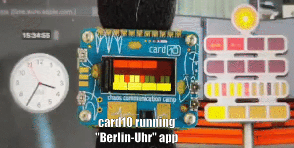

# Berlin-Uhr (aka the Mengenlehreuhr)
## The Berlin Clock

This project is a simulation of the so called ["Berlin-Uhr"](https://de.wikipedia.org/wiki/Berlin-Uhr) that can be displayed on the the [Card10 Badge](https://card10.badge.events.ccc.de/).

The clock, which was included in the Guinness Book of Records and has a total height of seven metres - including the mast - was erected on 17 June 1975, initially on the central strip of the Kurfürstendamm at the corner of Uhlandstrasse as the **"first clock in the world to display time with luminous coloured fields"**.
As a tribute to its inventor [Dieter Binninger](https://de.wikipedia.org/wiki/Dieter_Binninger), it is brought to life on the [Card10 Badge](https://card10.badge.events.ccc.de/).

## Demo:

## How to read the clock

### short:

| Time Unit | explanation |
| ------------- | ------------- |
| **hours**   | Multiply the number of luminous segments from row 1 by 5 and add the result with the number of luminous segments from row 2. |
| **minutes** | Multiply the number of luminous segments from row 3 by 5 and add the result with the number of luminous segments from row 4. |
| **seconds** | The second indicator is the blinking led on top of the clock. |

### extensive:

The time is displayed in a [Positional notation](https://en.wikipedia.org/wiki/Positional_notation) to the base of 5. 
The hours and minutes are represented by illuminated segments in four horizontally arranged stripes. 
In the first, second and fourth lines there are four luminaires and in the third eleven luminaires. 
The first two lines indicate the hour with red lights, with a luminous segment in the upper strip for five hours and in the lower one for one hour. 
The current hour results from the addition of the values. Accordingly, the minutes with yellow segments in steps of five and one are displayed in the two lower lines. The lamps for 15, 30 and 45 minutes are red for better readability. 
Above the lines there is a round flashing light which is switched on or off every second.

## The Original Clock:

  

  

